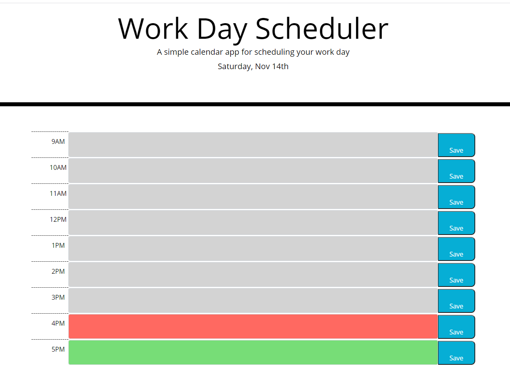

# Bootcamp Homework 05 - Third-Party APIs: Work Day Scheduler

## My Work Day Scheduler

This is an assignment to create a simple calendar application that allows a user to save events for each hour of the day.  Starter HTML and CSS files were provided with the Bootstrap CSS framework in place.  Requirements for the assignment were to dynamically update the HTML and CSS using jQuery along with the [Moment.js](https://momentjs.com/) library.  Expectation for the planner is that it contains time blocks for standard business hours that are color-coded to indicate if the time block is in the past, present, or future.  Data saved in the time block should persist on page refresh.   
   

### Homework Deliverables and Codebase Updates

* Updated the provided `index.html` and `style.css` files
* Utilized the Bootstrap grid system to create the main calendar display
  * Added a column with a `.data-hour` attribute to identify the "time" for each calendar row
  * Added a `textarea` column to hold the user entered text
  * Added a `button` to allow the user to save the `textarea` data
* Utilized the `.click()` jQuery method to save data to `localStorage`
* Added a conditional check on page refresh to pull data from `localStorage` if available
* Used the `.each()` method to loop over each calendar row to determine if the time block was in the past, present, or future.  
  * Compared the `.data-hour` attribute for each time block to the "now' variable using `.isBefore()` and `.isAfter()` methods from `Moment.js` library
* Created a README.md file to describe and demo the code
* Deployed the application to a live URL

### Notes on this project

* `Moment.js` is fun to work with :)
*  This assignment allowed me to get more comfortable in saving data to `localStorage`.  However, when pseudocoding I did not think to first check if there is data availble in `localStorage` on load of the page.  This part of the assignment confused me for a while in figuring out how to get the info.  
* I'm still struggling with styling, even when using the Bootstrap framework.  
  * The buttons do not contain an icon because I could not get the icon to display appropriately.  Every attempt I made either had an icon that was mis-aligned and too small, or else extended the button across the right side of the page.  
  * There is weird behavior that I could not effectively troubleshoot when clicking the buttons.
    * Some black lines appear behind/underneath the button when it's clicked.
    * The text on the button is not clickable, only the area around the text.
    * (in general, I will be continuing to work on understanding how to style a button)
  * The alignment of the borders for each column were somewhat difficult to work with.  I was able to (mostly) make everthing align through trial and error, but would like to improve my capabilities here.
  

## Screenshots

The following images show the Work Day Scheduler appearance and functionality:

## Application URL
* [Work Day Scheduler]([Moment.js](https://momentjs.com/))
